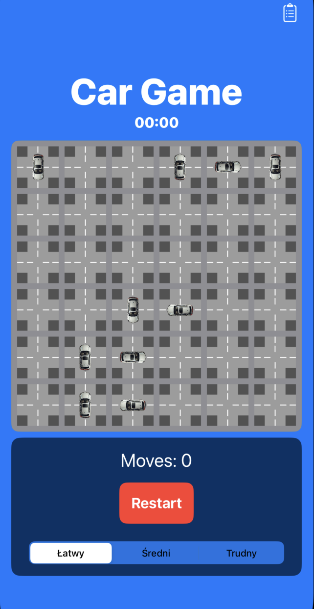
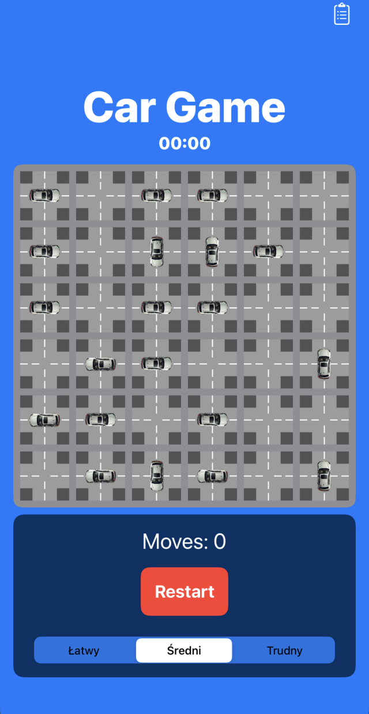
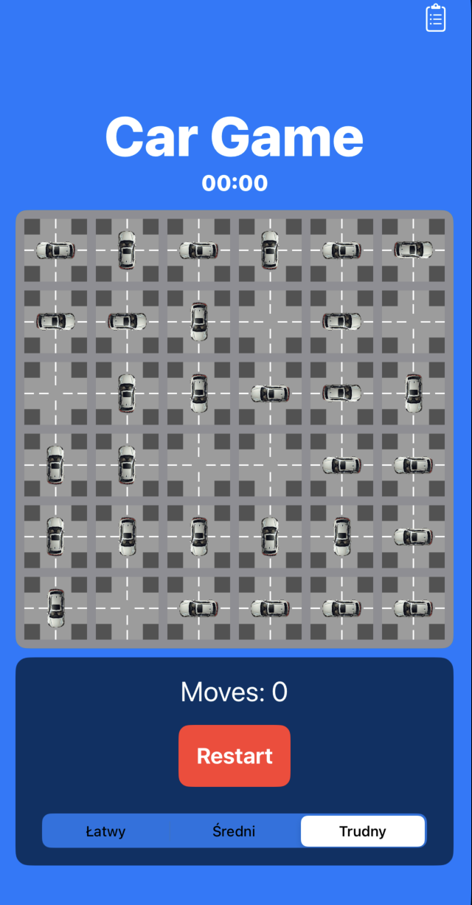
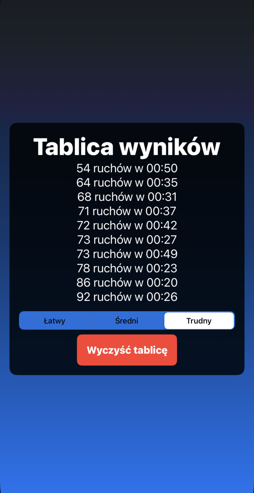

# Car Game
Mobilna gra na iOS.

---

## Spis treści
1. [Opis projektu](#opis-projektu)  
2. [Wymagania](#wymagania)  
3. [Instalacja](#instalacja)  
4. [Użycie](#użycie)  
5. [Funkcjonalności](#funkcjonalności)
6. [Galeria](#galeria) 
6. [Licencja](#licencja)  
7. [Kontakt](#kontakt)  

---

## Opis projektu
"Car Game" to wciągająca gra mobilna, w której gracz ma za zadanie wyczyścić planszę z samochodów w jak najmniejszej liczbie ruchów. Gra wymaga strategicznego myślenia i planowania, aby osiągnąć najlepsze wyniki.

---

## Wymagania

- **Hardware:**
    - Urządzenie z systemem MacOS (wymagane do zbudowania aplikacji).
  - Urządzenie mobilne z systemem iOS.

- **Oprogramowanie:**
  - Xcode do budowania i testowania gry.

---

## Instalacja
Instrukcja krok po kroku, jak skonfigurować i uruchomić projekt:

1. **Sklonowanie repozytorium:**
   ```bash
   git clone https://github.com/Adam-Sidor/CarGame
   ```

2. **Otwórz projekt w Xcode:**
   - Uruchom Xcode i zaimportuj projekt.

3. **Budowanie aplikacji:**
   - Wybierz docelowe urządzenie lub symulator w Xcode.
   - Kliknij przycisk "Run" (lub skrót klawiaturowy `Cmd + R`), aby zbudować i uruchomić aplikację.

4. **Zainstaluj grę na urządzeniu mobilnym:**
   - Użyj kabla USB, aby podłączyć urządzenie z iOS do komputera.
   - W Xcode wybierz swoje urządzenie jako cel i kliknij "Run".

---

## Użycie
1. Po instalacji uruchom grę na swoim iPhonie.
2. Wybierz poziom trudności.
3. Przesuwaj samochody, aby oczyścić drogę wyjazdową w jak najmniejszej liczbie ruchów.

---

## Funkcjonalności
- **Unikalne poziomy:**
  - Losowo generowane poziomy.
- **3 Poziomy trudności:**
  - Wybierz jedne z 3 dostępnych poziomów trudności.
- **Statystyki gracza:**
  - Śledź swoje najlepsze wyniki i rekordy.

---

## Galeria

Poniżej znajduje się kilka przykładowych zrzutów ekranu z gry:

- **Poziom łatwy:**
  

- **Poziom średni:**
  

- **Poziom trudny:**
  

- **Tablica wyników:**
  

---

## Licencja
Wszystkie prawa zastrzeżone. Gra została udostępniona wyłącznie w celach demonstracyjnych i edukacyjnych.  
- Możesz korzystać z tego projektu do użytku osobistego i edukacyjnego.  
- Wykorzystanie komercyjne lub redystrybucja projektu w całości lub w części wymaga wyraźnej pisemnej zgody autora.

---

## Kontakt
- **Autor:** Adam Sidor  
- **E-mail:** sidoadsi1@gmail.com  
- **LinkedIn:** [Mój profil](https://www.linkedin.com/in/adam-sidor-088a56341)